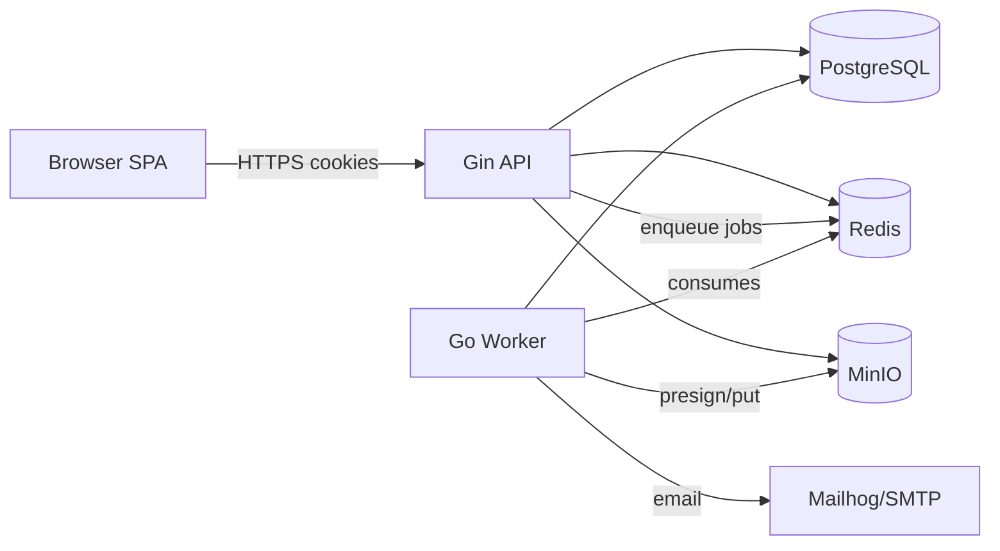

# 06 — System Architecture

## Container View



Services (docker compose): `api`, `worker`, `web` (nginx serving built SPA), `postgres`, `redis`, `minio`, `mailhog`.

## Backend: Modular Layered

```
request → middleware chain → handler → service → repository → GORM → PostgreSQL
```

- **handler**: HTTP concerns only — bind, validate shape, call service, write envelope.
- **service**: business rules, state machine, policy checks, transactions. No HTTP types.
- **repository**: GORM queries per module. Interfaces defined at consumer side for mocking.
- Modules: `auth, user, department, category, reimbursement, approval, dashboard, report, notification`. Cross-cutting in `pkg/`: response envelope, app errors, validator, jwt, password hash, minio client, redis client.

Chosen over clean/hexagonal for this scope: one implementation per port makes hexagonal ceremony without payoff; layered modules keep the diff small and reviewable while still testable at service boundaries. Trade-off stated honestly.

## Middleware Chain (order matters)

```
RequestID → StructuredLogger → Recoverer → CORS → SecurityHeaders
→ RateLimit(global) → CSRF(mutations) → AuthN(JWT cookie) → AuthZ(role) → handler
```

## Authentication Design

**Access token**: JWT, 15 min, HttpOnly+Secure+SameSite=Lax+Path=/. Stateless verification.
**Refresh token**: opaque random token, 7 days, HttpOnly+Secure+SameSite=Strict+Path=/api/v1/auth. Stored hashed in Redis (`refresh:<jti>`), single-use rotation on refresh; reuse of an old jti → revoke whole family + 401 (theft signal).
**Why cookies not localStorage**: XSS cannot read HttpOnly cookies; tokens never touch JS-reachable storage. Requirement #3 also mandates it.
**Cookie attributes**: `HttpOnly` blocks JS reads; `Secure` restricts to HTTPS; `SameSite=Lax` (access) balances SPA navigation vs CSRF surface, `Strict` (refresh) since refresh is only called same-site from JS; `Max-Age` fixed lifetimes; `Path` scoping limits where each cookie is sent.
**Logout**: delete Redis record + expire cookies.

## CSRF Strategy

**Double-submit with signed token.** On login the server sets `csrf_token` cookie (readable by JS, not HttpOnly) containing `nonce.HMAC(nonce, serverSecret)`. Mutating requests must send `X-CSRF-Token` header; middleware recomputes HMAC and compares nonce+header.

- Chosen over synchronizer-token-with-server-store: no session table lookup, horizontally scalable, trivially explainable.
- SameSite already blunts cross-site POSTs; double-submit closes the remaining gap because attacker sites cannot read our cookie to set the header.
- Token rotates on every login and via `/auth/csrf`.
- Why needed despite SameSite: Lax permits top-level navigations, older browsers ignore SameSite, defense-in-depth is the point of security reviews.

## Authorization

Two layers:
1. Route middleware: role gate (`RequireRole("admin")`) for coarse control.
2. Service layer: object-level checks — owner-or-scope logic ("manager sees own department", "only current step approver may act"). Middleware alone cannot express these; tests cover both layers.

## Concurrency & Consistency

- State transitions (`submit/approve/reject/pay/cancel`) run in a DB transaction with `SELECT ... FOR UPDATE` on the claim row → no double-approve/double-pay under concurrent clicks.
- Refresh rotation uses Redis atomic `GETDEL` → concurrent refreshes: exactly one wins, others replay queued requests.
- Optimistic locking available via `updated_at` version check on draft edits (low value elsewhere).

## Error Handling

Single error type in `pkg/apperr` carries code + safe message + optional details + cause. Handlers return errors up; one central error mapper converts to envelope (doc 04). Unknown errors → logged with request_id, returned as generic `INTERNAL_ERROR`. GORM/pg errors are translated (unique violation → 409) and never string-leaked to clients.

## Queue & Background Work

Redis-backed queue (asynq): jobs `email.send`, `report.generate`. Enqueued after commit (transactional outbox pattern lite: enqueue inside same tx via outbox row if time allows; otherwise post-commit enqueue accepted trade-off). Failed jobs retry exponentially (3 attempts), then dead-letter queue visible via asynq web UI; worker logs structured failure reasons.

## Performance & Observability

- Redis cache on dashboard aggregates (60 s TTL, keyed by role-scope), invalidated on relevant mutations.
- Rate limiting: login 5/min/IP+email (brute force), API 100/min/user sliding window in Redis.
- Security headers middleware: HSTS, X-Content-Type-Options, X-Frame-Options DENY, CSP.
- Structured JSON logging (slog) with request_id propagated to worker logs; `/healthz`; Prometheus `/metrics` endpoint.

## Testing Strategy

- **Unit**: services with repository mocks (state machine, policy engine, approval matrix) — the money is here.
- **Integration**: httptest against real Postgres/Redis via testcontainers; auth + reimbursement flows end-to-end at HTTP level.
- **Frontend**: Vitest + Testing Library for interceptor refresh race and key components.
- **E2E (stretch)**: Playwright — login → create → submit → approve → pay.
